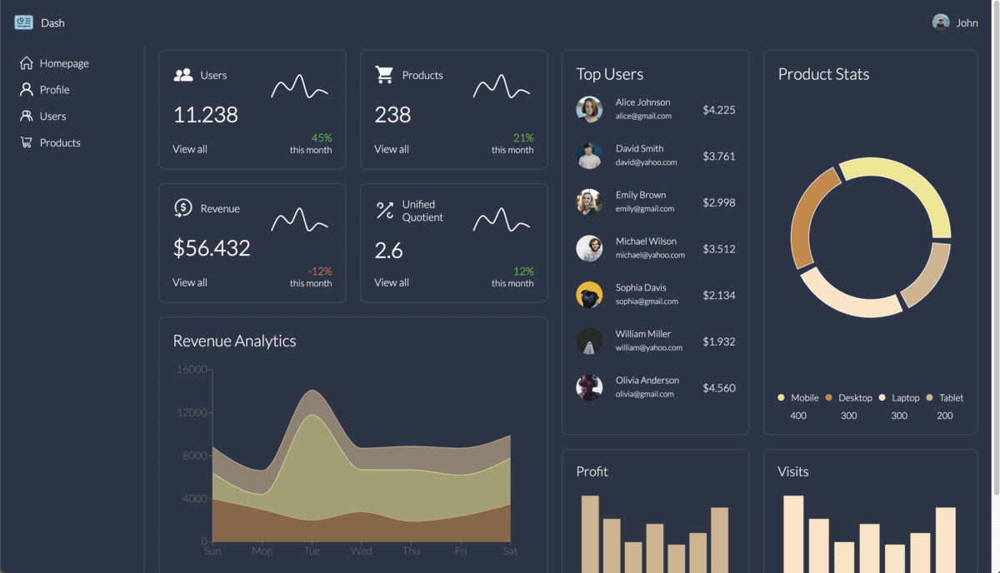

## 
# Admin Dashboard
This project is a design concept for an admin dashboard built using React, Vite, SCSS, Recharts, and TypeScript. It serves as a demonstration of good React practices for layout and is not fully functional. The primary goal of this repository is to showcase a visually appealing admin dashboard UI.


## Installation

To set up this project locally, follow these steps:

### Prerequisites
- Node.js

1. Clone the repository:
```shell
git clone https://github.com/thebugged/admin-dashboard.git
```

2. Install the Node.js dependencies:
```shell
cd admin-dashboard
npm install
```
or 
```shell
npm install --force
```

## Running the App

1. After installing the dependencies, you can start the development server:
```shell
npm run dev
```

The app will be accessible at http://localhost:3000/.
